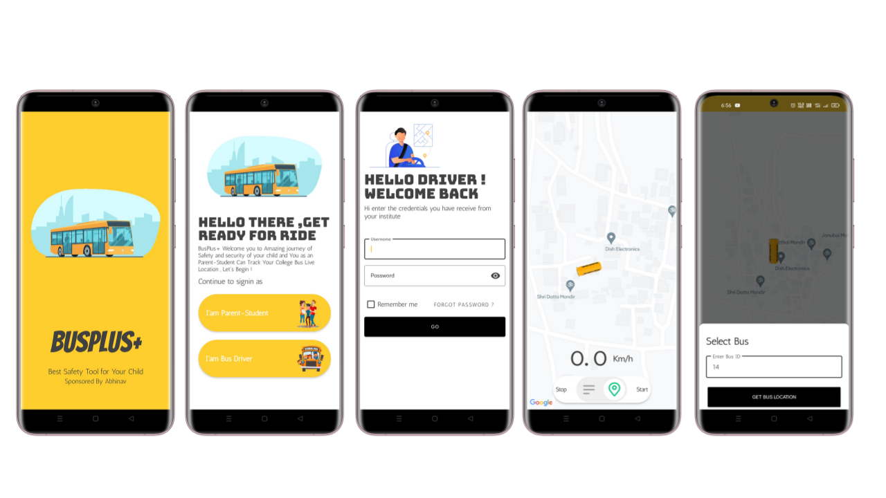

# Busplus-Android-Application

This is an Android Application Specially Design to Solve problem which are faced by me at my college , " We are not able to track Live location of bus because of it . we always have a fear to miss a bus to college or some time if bus get late we have to wait for a long time on road which is waste of time ! so I decided to Implement this Android Application based service by taking Inspiration from UBER 🚘 ! 

While developing this project I learned about ! <ul><li>Firebase Database</li><li>google maps api</li><li> google location api</li> <li>Material UI </li> <li> Local storage - Shared Preference </li>
	<li> Learned New Concepts of Oop's</li> </ul> 

- [Backend (Firebase Cloud Functions)](#)

***
### Screenshots

***
### References
- [Set Up Google Play Services](https://developers.google.com/android/guides/setup)
- [Getting Started - Google Maps](https://developers.google.com/maps/documentation/android-api/start)
- [Get API Key](https://developers.google.com/maps/documentation/android-api/signup)
- [Add Marker in Maps](https://developers.google.com/maps/documentation/android-api/map-with-marker)
- Firebase Documentation (Guides) ([Link](https://firebase.google.com/docs/guides/))
- [Get Started with Firebase Firestore](https://firebase.google.com/docs/firestore/quickstart)
- [Firestore Data Model](https://firebase.google.com/docs/firestore/data-model)
- [Firestore - Get Data](https://firebase.google.com/docs/firestore/query-data/get-data)
- [Firestore - Structure Data](https://firebase.google.com/docs/firestore/manage-data/structure-data)

***
### How it works?

- First Bus driver will start sharing location of his smartphone with current odometer reading !
  ( The Driver device send continous location update from gps, network etc. )

- This location data will get saved in firebase realtime database 
  ( Write and update the location data to a specific firebase firestore document )
  
- Student Module ( App ) will get Updated from database as the location co-ordinates get changes
  ( in short  the user device read that firebase firestore document and show the marker in that location )

- As trip ends Driver Turn off location sharing with that he will also enter its latest odometer reading by which me can calculate Fuel       consumtion with distance traveled and total cost for that trip !

 ****************************************************Thank You******************************************************
